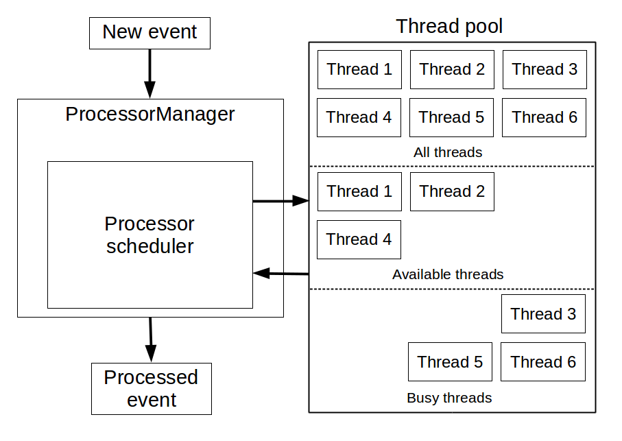
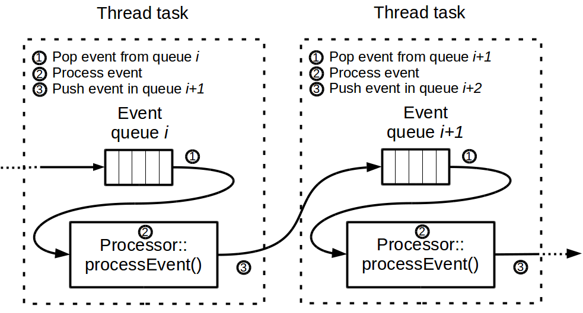
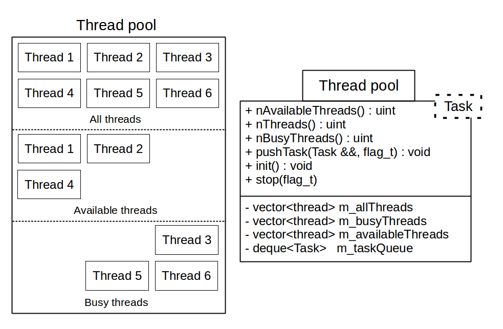

# Specification and TODO things to get a MT version of Marlin

Many ways to implement a MT version. Here is one of them which is, to me, the simplest way to do it, with minor things to modify to get a first working version.

## MT on processors with queued scheduling :

- init() and end() as usual.
- processors organized in double-linked list. Use a thread pool with a fixed (n_th) number of threads. Processor::processEvent() calls are linked in different threads. The processed event for a single processor is pushed in the queue of the next processor.
- Only n_th processor can process events at the same time.

### Pros and cons
#### Pros :
- No lock for user in their processor since Processor::processEvent() is called one at a time in a single thread.

#### Cons :
- ...

### Gain on performances

For N processors, the processing time with MT is limited by :
- the number of threads
- the processing time of the processor that takes the longest time to process an event.

### Things to adapt to get MT

#### In LCIO :

- In LCReader, LCEventListener : when an event is read from a file, the previous one is deleted.
LCEvent * should be transformed in a shared_ptr&lt;LCEvent> in SIOReader. Best way to do this is to implement a new SIOReader that owns a shared_ptr&lt;LCEvent>

#### In Marlin :

- In Marlin.cc, create a lcio file reader that support shared_ptr and pass the lcReader instance to processor manager singleton. Each time ProcessorManager::processEvent() is called, get the shared_ptr of the current event and store it to avoid event deletion. At end of process event call, remove the shared_ptr instance and thus the event.

- Implement a thread pool for Marlin, but generic enough to be reusable.

- In ProcessorManager, use the thread pool to start n_th threads. Store the processors in a double-linked list, and implement the logic of processor chain.

### MT architecture

#### Global processing

#### Thread tasks

Each *Processor::processEvent(evt)* call is encapsulated in a thread task with an event queue.

The thread task processes as follow :
- An event is poped from the event queue
- The poped event is processed
- The event is pushed in the event queue of the next *Processor*

#### Thread pool

The thread pool manage a certain and fixed number of thread allocated at startup (ThreadPool::init()). User can push tasks to be processed as soon as a thread is available. Tasks can be enqueued or directly processed if a thread is available.

*Task* is a template parameter of the *ThreadPool* class. It is a class should provide 3 methods :

- taskInit() : initialisation before processing
- taskProcess() : the main task function
- taskEnd() : for any operation after the task processing  

In case of Marlin :

- taskInit() : Pop an event from the event queue of the processor being processed
- taskProcess() : Process the event, calling *Processor::processEvent(evt)*
- taskEnd() : Notify the scheduler that an event has been processed by the processor. The scheduler will take care about enqueing a new task for the next processor with the processed event

#### The processor scheduler

The scheduler takes care of the task processing logic within Marlin. New events read from LCIO files are pushed in the scheduler to be processed. A new event can't be pushed in the scheduler if the limit of enqueued events is reached. In this case, the ProcessorManager will wait for at least on enqueued event to be finished and push the new event.

Scheduler::run() :
- check if the number of events doesn't exceed the limit (MAX_EVENT_CONCCURENCY). In this case, a new event is read from the LCIO file and a new task is pushed task queue of the thread pool.
- check if some processor tasks have finished. In this case, 4 situtations may appears :

  - the processor is the last of the chain. No task is queued. The event is deleted.
  - the processor is not the last of the chain. A new task is queued to with the same event and the next processor.
  - during the processing, a SkipEventException has been caught. Then no new task is queued and the event deleted + "Skip events statistics ++"
  - during the processing, an other exception as been caught (not a SkipeEventException). All tasks are asked to terminate asap (or force to terminate ?) and the scheduler exits by throwing again this exception.

.
